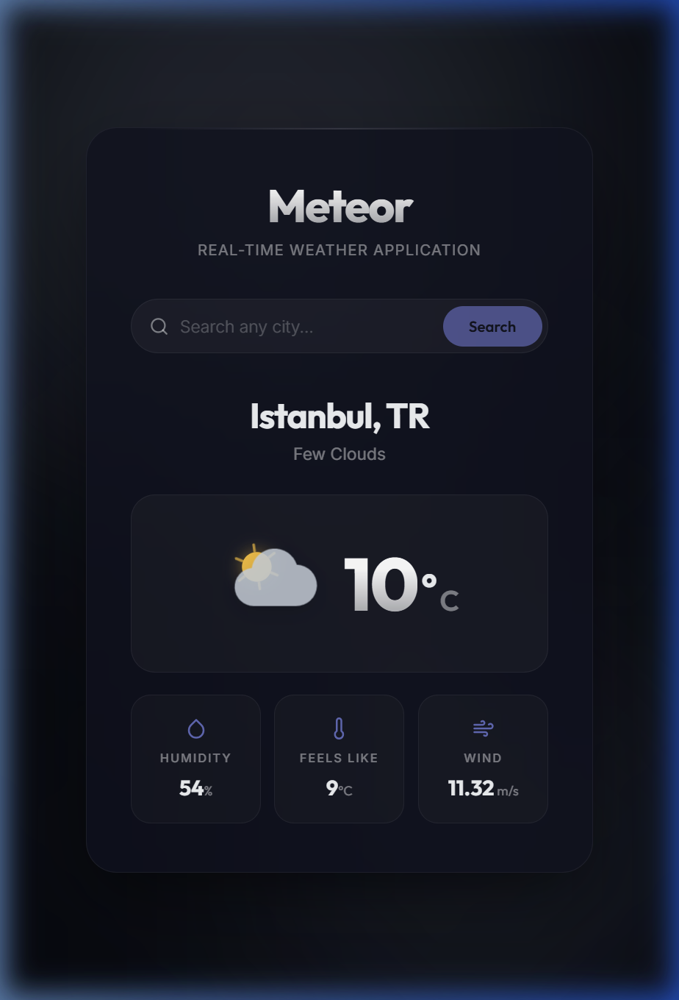

<div align="center">

# ☄️ Meteor

**A premium, real-time weather application with dynamic weather-reactive backgrounds, hand-crafted animated SVG icons, and a glassmorphism UI — built with React & Vite.**

[](https://react.dev)
[](https://vite.dev)
[](https://vercel.com)
[](LICENSE)



</div>

---

## ✨ Key Features

- 🌦️ **Real-Time Weather Data** — Fetches live conditions, temperature, humidity, wind speed, and "feels like" via the [OpenWeatherMap API](https://openweathermap.org/api).
- 🎨 **Dynamic Weather-Reactive Backgrounds** — Ambient floating orbs smoothly shift colour and animation speed based on the current weather condition (clear, clouds, rain, thunderstorm, snow, mist).
- 🧊 **Premium Glassmorphism UI** — Frosted-glass card with `backdrop-filter`, soft drop shadows, and a subtle top-edge highlight for depth.
- ☀️ **Hand-Crafted Animated SVG Icons** — 10 bespoke weather icons (sun with rotating rays & warm glow, drifting clouds, falling rain, flickering lightning, tumbling snowflakes, and more) — zero external icon dependencies.
- 🎞️ **Staggered Entrance Animations** — Weather data cascades into view with sequenced `translateY + scale` transitions powered by cubic-bezier easing.
- 🖱️ **Micro-Interactions** — Expanding conic-gradient glow on search focus, 3D lift hover physics on cards, and a gentle bounce on the weather icon.
- 💀 **Skeleton Loading States** — Shimmer-based skeleton loader mirrors the exact layout of the final display, eliminating layout shifts during API fetches.
- 🔐 **Secure API Key Handling** — API key stored in a `.env` file, loaded via Vite's `import.meta.env`, and excluded from version control through `.gitignore`.

---

## 🛠️ Tech Stack

| Layer         | Technology                                                         |
| ------------- | ------------------------------------------------------------------ |
| **Framework** | [React 19](https://react.dev)                                      |
| **Bundler**   | [Vite 7](https://vite.dev)                                         |
| **Styling**   | Vanilla CSS (custom properties, keyframe animations, glassmorphism)|
| **Icons**     | Hand-crafted animated SVGs (no external library)                   |
| **Fonts**     | [Outfit](https://fonts.google.com/specimen/Outfit) + [Inter](https://fonts.google.com/specimen/Inter) via Google Fonts |
| **API**       | [OpenWeatherMap — Current Weather](https://openweathermap.org/current) |
| **Deploy**    | [Vercel](https://vercel.com) (recommended)                        |

---

## 🚀 Getting Started

### Prerequisites

- **Node.js** ≥ 18
- **npm** ≥ 9 (or yarn / pnpm)
- A free [OpenWeatherMap API key](https://home.openweathermap.org/api_keys)

### Installation

```bash
# 1 — Clone the repository
git clone https://github.com/your-username/meteor-weather.git
cd meteor-weather

# 2 — Install dependencies
npm install

# 3 — Create your environment file
cp .env.example .env
```

Open the newly created `.env` file and replace the placeholder with your own API key:

```env
VITE_OPENWEATHER_API_KEY=your_actual_api_key_here
```

### Run the Dev Server

```bash
npm run dev
```

The app will be live at **http://localhost:5173** — open it in your browser and search for any city! 🌍

### Build for Production

```bash
npm run build
npm run preview
```

---

## 📁 Project Structure

```
src/
├── components/
│   ├── SearchBar.jsx          # Pill-shaped search with focus glow
│   ├── SkeletonLoader.jsx     # Shimmer skeleton matching final layout
│   ├── WeatherDisplay.jsx     # Staggered weather cards + detail items
│   └── WeatherIcon.jsx        # 10 hand-crafted animated SVG icons
├── services/
│   └── weatherApi.js          # OpenWeatherMap fetch wrapper
├── App.jsx                    # Theme derivation + ambient orb renderer
├── index.css                  # Full design system (~1100 lines)
└── main.jsx                   # React entry point
```

---

## 🌈 Weather Themes

| Condition      | Orb Palette              | Animation                |
| -------------- | ------------------------ | ------------------------ |
| ☀️ Clear       | Warm ambers & golds      | Fast pulse (10s)         |
| ☁️ Clouds      | Cool slates & greys      | Slow drift (20–24s)      |
| 🌧️ Rain       | Blues & cobalts           | Medium pace (8s)         |
| ⛈️ Thunderstorm| Deep violets & purples   | Rapid pulse + enlarged   |
| ❄️ Snow        | Soft indigos & whites    | Very slow (25s)          |
| 🌫️ Mist       | Muted slates & silvers   | Default                  |

---

## 📜 License

This project is open-source and available under the [MIT License](LICENSE).

---

<div align="center">
  <sub>Built with ☄️ by <strong>You</strong></sub>
</div>
